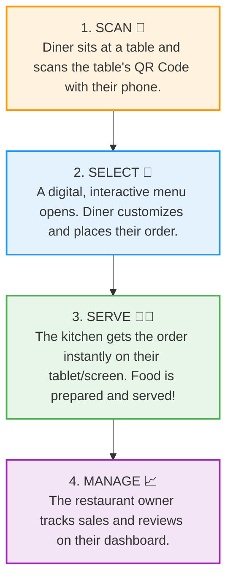

# FoodieQR: Project Synopsis & Business Guide
*A non-technical guide to what FoodieQR is, what problems it solves, and how it works.*

---

## 🗣️ The "Explain It Like I'm 5" Pitch
*(Use this when talking to friends, family, or potential investors who don't know anything about coding or technology)*

> **Imagine you walk into a busy restaurant.** 
> You sit down at a table, but all the waiters are running around busy. You wait 10 minutes just to get a paper menu, and another 10 minutes to grab a waiter's attention to place your order. When the food arrives, it's not what you wanted, and at the end of the meal, you have to wait again just to get the bill. 
> 
> **FoodieQR solves this.** 
> Instead of waiting, you just point your phone's camera at a small sticker (a QR code) on your table. Instantly, a beautiful menu pops up on your phone. You can browse dishes, customize your food (like asking for extra cheese), and send your order straight to the kitchen in seconds. 
> 
> For the restaurant owners, it is like having a digital assistant that handles ordering, updates menu items instantly, and tracks their sales—saving them time and money while making their customers much happier.

---

## 🛑 The Problems We Are Solving

Running and dining at a restaurant today is full of small, frustrating friction points. Here is what we are fixing:

| For the Diners (Customers) | For the Restaurant Owners |
| :--- | :--- |
| ⏳ **Waiting Times:** Waiting to get a menu, waiting to place an order, and waiting to pay. | 💸 **High Printing Costs:** Printing paper menus every time a price changes, a dish is added, or a page gets dirty is expensive. |
| 🗣️ **Order Misunderstandings:** Waiters mishearing custom requests (e.g., "no onions" or "extra spicy"). | 🏃‍♂️ **Overworked Staff:** Staff spending too much time taking orders and running bills back and forth instead of focusing on hospitality. |
| 📖 **Boring Static Menus:** Paper menus don't have high-quality photos, allergen filters, or real-time stock updates (ordering something only to find out it is sold out). | 📊 **Lack of Business Data:** No easy way to know which dishes are selling best, when their busiest hours are, or what their customers think. |

---

## 💡 The Solution: How FoodieQR Works

We bridge the gap between diners and the kitchen with a seamless three-step flow:

---

## 🌟 Key Features (In Plain English)

FoodieQR is a three-part system, each designed for a different user:

### 1. For the Diners (The Web App)
No app downloads are required. Diners simply scan and start using it instantly in their mobile browser:
*   **Beautiful Interactive Menus:** Large, delicious pictures of food, clear pricing, and dish descriptions.
*   **Easy Customizations:** Add notes (e.g., "extra spicy") or select add-ons (e.g., "add bacon") easily.
*   **Digital Cart & Favorites:** Save favorite items and review the total cost before placing the order.
*   **Order History:** Look back at past orders and see what they've enjoyed before.

### 2. For the Restaurant Owners (The Admin Dashboard)
A command center for running the business smoothly:
*   **Real-time Order Board:** A screen that updates live as orders come in from tables, showing which table ordered what.
*   **No-Code Menu Manager:** Owners can change prices, mark items as "sold out," or add new dishes instantly without paying a designer or developer.
*   **Custom QR Generator:** A tool to create and print unique QR codes for every table (e.g., Table 1, Table 2) so the kitchen always knows exactly where to deliver the food.
*   **Customer Reviews:** A place to see feedback left by diners to keep service quality high.

### 3. For the Platform Owner (The Super Admin)
Since this is a **subscription service (SaaS)**, there is a global control room:
*   **Restaurant Manager:** See and manage all the restaurants registered on the platform.
*   **Subscription & Payments:** Track who has paid for their monthly/yearly packages and who needs upgrading.
*   **Global Settings & Packages:** Create different pricing plans (e.g., a "Basic Plan" with limited tables vs. a "Premium Plan" with unlimited tables and customized themes).

---

## 📈 Why This Project Wins (The Business Value)

If you are explaining why this project is valuable to a business partner, here are the key benefits:

1.  **Increases Sales (Higher Order Value):** When customers see high-quality photos of food and easy add-ons on their phones, they tend to order **20% to 30% more** than they would from a waiter.
2.  **Faster Table Turnovers:** Customers order faster and leave faster because they don't have to wait for human service, allowing restaurants to serve more people in a day.
3.  **Reduces Human Errors:** Because customers click the exact items they want, there is no chance of a waiter mishearing or writing down the wrong order.
4.  **Saves Labor Costs:** Restaurants can run smoothly with fewer front-of-house staff, especially during off-peak hours or labor shortages.
